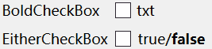
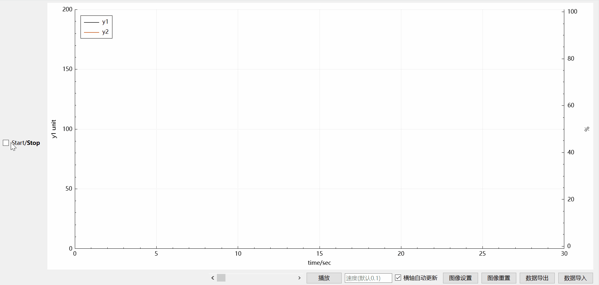

# MyWidgets

Some Qt widgets for convenience

## CheckBox
- BoldCheckBox\
	A checkbox that sets text to bold when checked
- EitherCheckBox\
	A checkbox that takes two options and highlights the checked option

## Plot

A plot that displays real time data, based on QCustomPlot

